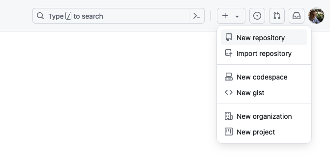

# Getting Started
The majority of our codebase is open-source, although some additional resources and code is reserved for members of our community. We welcome PRs; improvements benefit us all.

Startup101.io is a monorepo, we share packages and infrastructure code. We recommend you build your apps inside the monorepo to make the most of our setup, although your app's codebase will be private and stored in its own repo.

## New Github repo

We need to setup a new Github repo for your private copy of startup101.io. This will allow you to keep your apps private and prevent copy-cat sites.

In Github, create a new repository. Make it **private**.

:::tip Tips
I suggest that you call it startup101.io just for simplicity.
:::



## Duplicate startup101.io

### Create a private folk of startup101.io
```shell
git clone --bare https://github.com/startup101-io/startup101.io.git
cd startup101.io.git
```

### Push your startup101.io repo to github

:::info Required
You need to change `yourname` to your github username in these commands.
:::

```shell
git push --mirror https://github.com/yourname/startup101.io.git
cd ..
rm -rf startup101.io.git
```


## Clone your private repo

```shell
git clone https://github.com/yourname/startup101.io.git
cd startup101.io

**create your apps**

git commit
git push origin master
```

### Edit .gitignore
To allow git to access the apps directory we need to edit the .gitignore file in the root of startup101.io.
Remove the apps directory from .gitignore. You can just comment it out.
```shell title=".gitignore"
# apps/*
```

## Pull new updates from startup101.io
To make the most of community contributions, it is wise to pull new updates from the public startup101 repo.

First, make sure you have committed all of your work. Then:

```shell
cd startup101.io
git remote add public https://github.com/startup101-io/startup101.io.git
git pull public master # Creates a merge commit
git push origin master
```

Now, you have updated startup101.io.

:::note
You will need to comment out `apps/*` in .gitignore again.
:::

## Contribute to startup101.io
Use the GitHub UI to create a fork of the [public startup101 repo](https://github.com/startup101-io/startup101.io) (the small "Fork" button at the top right of the public startup101 repo page). Then:

```shell
git clone https://github.com/yourname/the-fork.git
cd the-fork
git remote add private_repo_yourname https://github.com/yourname/startup101.io.git
git checkout -b pull_request_yourname
git pull private_repo_yourname master
git push origin pull_request_yourname
```

For more help on this, see the [Github Docs](https://docs.github.com/en/pull-requests/collaborating-with-pull-requests/proposing-changes-to-your-work-with-pull-requests/creating-a-pull-request-from-a-fork).

Once project owners review your pull request, they can merge it.

<!-- :::tip My tip
This thing
::: -->

<!-- 
## Git Submodules

Our monorepo uses [git submodules](https://git-scm.com/book/en/v2/Git-Tools-Submodules) to keep your app code seperate from the community shared code.

### Allow Submodules to update

Before doing anything with submodules, I recommend running this command to update the config and set [submodule.recurse](https://blog.bitsrc.io/how-to-utilize-submodules-within-git-repos-5dfdd1c62d09#:~:text=config%20and%20set-,submodule.recurse,-to%20true%2C%20which) to `true`, which allows `git clone` and `git pull` to automatically update submodules. (Trust me, this definitely makes life easier, later on).

```shell
git config --global submodule.recurse true
```

If you forgot to do this first, you can run this (next) command after the fact.

```shell
git submodule update --init --recursive
```

### Add Submodule to Apps
To allow git to access the apps directory we need to edit the .gitignore file in the root of startup101.io
Remove the apps directory from .gitignore. You can just comment it out.
```shell
# apps/*
```

If your repo is not the url of your app, now is the time to correct that by making it name of the directory.
We want to put your app into the apps folder, so make sure you include `apps/` in the second parameter.

```shell
git submodule add [URL of project to add in GitHub] apps/[name of directory you want to see in the project]
```

:::tip My EntrepreneurList App
Heres what my full git submodules command looks like:

```shell
git submodule add git@github.com:startup101-io/entrepreneurlist.io.git apps/entrepreneurlist.io
```
:::

### check .gitmodules

The previous command should have added your app to the .gitmodules file in the root of startup101.io.
Open it up and you should see something like:

```shell
[submodule "apps/appname.com"]
	path = apps/appname.com
	url = git@github.com:username/appname.com.git
``` -->

<!-- ### Add your app to a new Github repo

```shell
git remote -v
# View existing remotes
# origin  https://github.com/user/repo.git (fetch)
# origin  https://github.com/user/repo.git (push)

git remote set-url origin https://github.com/user/repo2.git
# Change the 'origin' remote's URL

git remote -v
# Verify new remote URL
# origin  https://github.com/user/repo2.git (fetch)
# origin  https://github.com/user/repo2.git (push)
```
 -->
